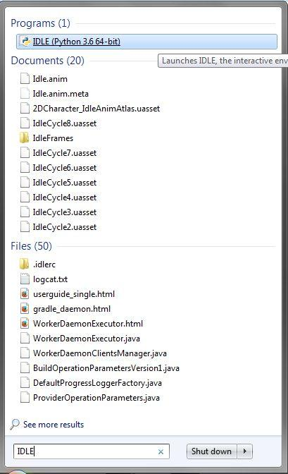
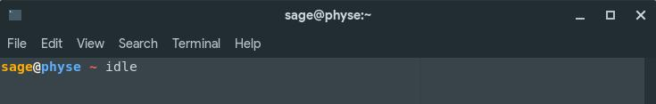
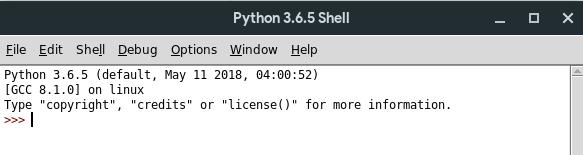
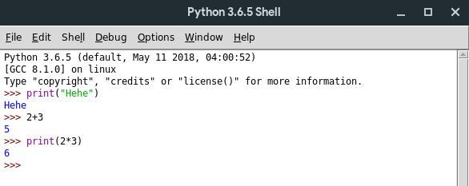
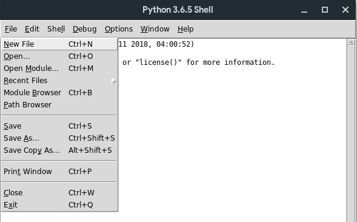
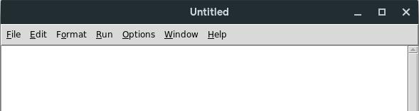
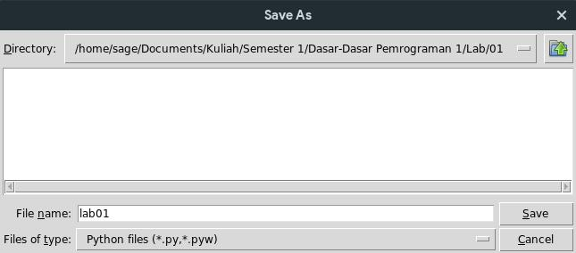
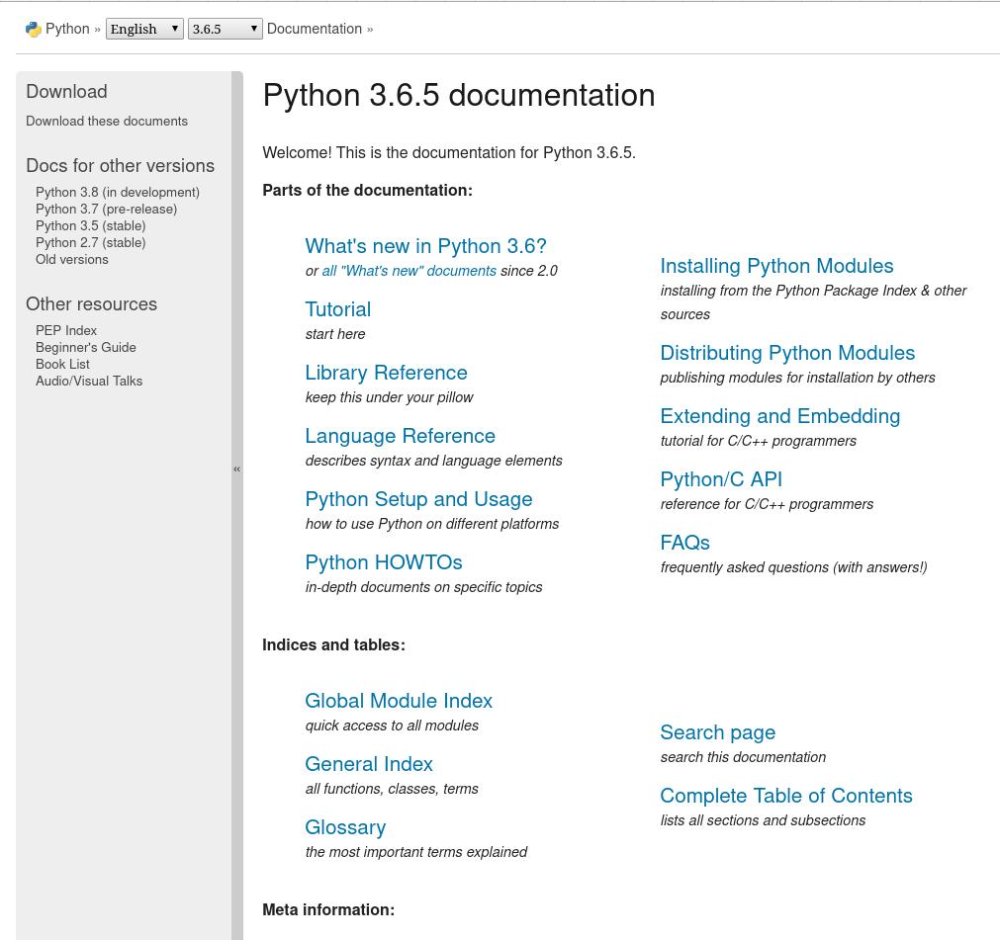
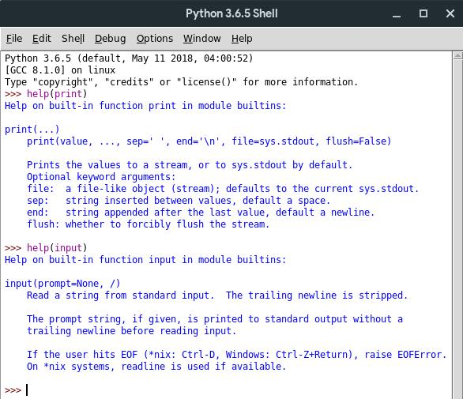

# Tutorial 1 : Program Sederhana

## Daftar Isi

- [Tutorial 1 : Program Sederhana](#tutorial-1--program-sederhana)
  - [Daftar Isi](#daftar-isi)
  - [IDLE](#idle)
    - [Membuka IDLE](#membuka-idle)
    - [Membuat *file* kode Python](#membuat-file-kode-python)
    - [Menyimpan *module* python](#menyimpan-module-python)
    - [Menjalankan program](#menjalankan-program)
  - [Membuat program sederhana](#membuat-program-sederhana)
    - [Meminta masukan *(input)*](#meminta-masukan-input)
      - [Assignment](#assignment)
      - [Konversi](#konversi)
    - [Mencetak keluaran *(print)*](#mencetak-keluaran-print)
  - [Tambahan](#tambahan)
    - [Errors](#errors)
    - [Syntax](#syntax)
    - [Whitespace](#whitespace)
    - [Continuation](#continuation)
    - [Comments](#comments)
    - [Dokumentasi](#dokumentasi)
  - [Latihan : *Profit Calculator*](#latihan--profit-calculator)
  - [Tugas : *Circle Area & Perimeter*](#tugas--circle-area--perimeter)
    - [Deskripsi Soal](#deskripsi-soal)
      - [Contoh](#contoh)
      - [Hint](#hint)
    - [Bonus](#bonus)
    - [Komponen penilaian](#komponen-penilaian)


## IDLE

[**IDLE**][idle docs] adalah **I**ntegrated **D**evelopment and **L**earning **E**nvironment. Pada intinya, IDLE adalah tempat untuk mengembangkan program dengan bahasa Python yang telah disediakan oleh [**Python**][python org]. Dalam tutorial kali ini, kita akan mempelajari bagaimana menggunakan IDLE untuk membuat program sederhana.


### Membuka IDLE

- **Di Windows**
Untuk membuka IDLE, cukup klik **Start** dan masukkan `IDLE` pada *search field*, lalu pilih **IDLE (Python 3.x 64-bit/32-bit)**


- **Di OS berbasis Unix**
Buka **Terminal**, ketik `idle`, lalu tekan <kbd>Enter</kbd>. Jika sudah ada *file* `.desktop` untuk IDLE di Desktop Environment kalian, bisa juga mengikuti langkah yang serupa dengan di Windows.


Kemudian akan muncul *window* bernama *Python Shell* seperti di bawah ini.



Kalian bisa langsung memberi perintah pemrograman di samping tanda `>>>`, seperti contoh berikut.




### Membuat *file* kode Python

Untuk membuat ***file*** (berkas) di IDLE, cukup klik **`File`** -> **`New File`** atau menggunakan *shortcut* <kbd>Ctrl</kbd> + <kbd>N</kbd>, seperti gambar di bawah.



Kemudian, akan muncul *file* kosong seperti berikut.



Di sini, kalian bisa memberikan instruksi pemrograman sama seperti di IDLE tadi. **Perbedaannya** adalah program kalian tidak akan langsung dijalankan saat membuat *file* dan harus dijalankan secara manual (akan dijelaskan nanti).

**Masukkan program di bawah ini ke dalam *file* yang kalian buat.**

```python
print("Halo!")
nama = "nama kalian"
print("Selamat Datang di ITnC" ,nama)
```


### Menyimpan *module* python

Untuk menjalankan program, **simpan** terlebih dahulu *file*-nya dengan **`File` -> `Save`** atau <kbd>Ctrl</kbd> + <kbd>S</kbd>, lalu beri nama *file*-nya, lalu tekan **`Save`**.



*File* python yang disimpan dengan akhiran `.py` akan menjadi *pyhton module*.


### Menjalankan program

Untuk **menjalankan program**, cukup klik **`Run` -> `Run Module`** atau tekan <kbd>F5</kbd>. Perlu diingat bahwa IDLE tidak akan menjalankan program jika *file* belum disimpan.


## Membuat program sederhana

**Buat** *file* baru yang berisi kode program berikut, kemudian jalankan.

```python
nama = input("Nama: ")
tahun_lahir = int(input("Tahun lahir: "))
tahun_sekarang = 2018 #isi sesuai tahun sekarang

umur = tahun_sekarang - tahun_lahir
print("Halo,", nama)
print("Umur kamu",umur,"tahun kan?")
print("Selamat belajar di Smanitra ya!")
```

### Meminta masukan *(input)*

```python
input("Masukkan data")
```
`input()` berguna untuk meminta data dari pengguna (*user*). Tulisan `"Masukkan data"` akan muncul di layar dan python akan menunggu sampai *user* mengetik sesuatu dan menekan <kbd>Enter</kbd>.

#### Assignment

```python
variabel = input("Masukkan data")
```

Hasil input perlu dimasukkan ke dalam sebuah *variable*. Nilai dari *variable* ini bisa dipakai untuk kalkulasi atau dimunculkan kembali di layar.

Simbol `=` **bukan** berarti **sama dengan**. Artinya adalah `nilai` di sebelah **kanan** dimasukkan ke dalam `variable` di sebelah **kiri**.

> Kalian akan mempelajari variable lebih lanjut di [lab_2](../lab_2/README.md)

#### Konversi

```python
variabel = int(variabel_lain)
```

Nilai input dari user selalu berbebntuk *string* (barisan huruf/karakter). Untuk memberlakukan nilai input sebagai angka (bisa dilakukan operasi matematika), maka perlu dikonversi menjadi *integer* (bilangan bulat).

### Mencetak keluaran *(print)*

```python
myVar = 12
print("myVar mempunyai nilai", myVar)
```

Fungsi `print` dapat **mencetak** (menampilkan) teks ke dalam layar.
- Untuk mencetak dua atau lebih elemen yang berbeda, pisahkan dengan koma `,`.
- Untuk mencetak *string* (teks/tulisan), masukkan tulisannya dengan dikelilingi tanda kutip `"..."`.
- Untuk mencetak nilai dari *variable*, masukkan nama *variable* nya.

Setelah *print statement*, kursor akan pindah ke baris baru. *Print statement* yang kosong akan mencetak sebuah baris kosong

**contoh:**
```python
print(3+4)
print(3, 4, 3+4)
print()                 # print baris kosong
print(3, 4, end=" ")    # kursor tidak pindah ke baris baru, melainkan mencetak spasi
print(3 + 4)            # berada di baris yang sama dengan "3 4"
print("The answer is", 3+4)
```
*output:*
```
7
3 4 7

3 4 7
The answer is 7
```

---

## Tambahan

> Materi ini tidak perlu dijelaskan di kelas. Silakan baca sendiri di rumah.

### Errors

Jika shell mengeluarkan pesan error dengan warna merah, berarti kodingan (kode) mu error dan tidak bisa dijalankan. **Baca pesan error dengan baik** (biasanya dicantumkan baris ke berapa yang salah) dan perbaiki kodinganmu. Proses memperbaiki error disebut *debugging*.

### Syntax

*Syntax* adalah komponen [leksikal](https://en.wikipedia.org/wiki/Lexical) (merujuk pada kata) dalam bahasa pemrograman. Contoh: `print`, `input`

### Whitespace

*Whitespace* adalah karakter yang tidak tercetak pada layar (contoh: spasi, tabs, new line, dll). Pada umumnya *whitespace* bisa diletakkan pada kodingan agar lebih mudah dibaca.

### Continuation

Jika suatu baris *statement* terlalu panjang, kamu tidak bisa begitu saja memindahkan sebagian kodinganmu di baris yang baru karena bisa menyebabkan *error*.

Gunakan *backslash* `\` untuk memecah *statement* yang terlalu panjang ke dalam beberapa baris.

Kamu juga bisa memecah *statement* pada sebelum/sesudah tanda `,`

**contoh:**
```python
jumlah_laki_laki = 13
jumlah_perempuan = 17

jumlah_murid = jumlah_laki_laki \
+ jumlah_perempuan

print("Jumlah anak laki-laki adalah",jumlah_laki_laki,
      "sedangkan jumlah anak perempuan adalah",
      jumlah_perempuan, "sehingga jumlah murid adalah"
      ,jumlah_murid)
print()
print("Ini adalah contoh string yang terlalu panjang \
untuk ditulis dalam satu baris. Jangan gunakan indentasi \
setelah tanda backlash. Tanda \ yang tidak diikuti oleh \
baris baru akan tercetak di layar.")
```
*output:*
```
Jumlah anak laki-laki adalah 13 sedangkan jumlah anak perempuan adalah 17 sehingga jumlah murid adalah 30

Ini adalah contoh string yang terlalu panjang untuk ditulis dalam satu baris. Jangan gunakan indentasi setelah tanda backlash. Tanda \ yang tidak diikuti dengan baris baru akan tercetak di layar.
```

> Lebar dari program python direkomendasikan tidak lebih dari 79 karakter

### Comments

*Comment* dapat ditulis dengan diawali tanda pagar `#`. Tulisan yang diawali tanda pagar tidak akan diproses oleh python. 

*Comment* berguna untuk menulis informasi yang akan membantu pembaca memahami kode tersebut.


*Comment* juga berguna untuk menghapus *statement* sementara.
```py
# Program ini akan mencetak 2 baris kalimat

print("Halo semua.")
#print("Baris ini tidak akan diproses python.")
print("Terima kasih sudah membaca tutorial ini.")
```
```
Halo semua.
Terima kasih sudah membaca tutorial ini.
```


### Dokumentasi

Terkadang kita kebingungan mengenai kegunaan suatu fungsi. Python sudah menyediakan **dokumentasi** mengenai hal tesebut. Dokumentasi dapat kalian akses dengan mengklik **Help** -> [**Python Docs**][python docs].



Atau, kalian juga bisa menggunakan fungsi `help(parameter)` di mana `parameter`nya merupakan fungsi atau objek yang ingin kalian cari tahu.



Atau, kalian juga bisa mencarinya di [**Google**][google] atau [**StackOverflow**][stackoverflow] jika kurang paham setelah membaca dokumentasi.

---

## Latihan : *Profit Calculator*

Buatlah program yang dapat menghitung selisih dari pendapatan dan pengeluaran yang diberikan oleh *user*.

**contoh:**
```
Masukkan pendapatan  : 250000
Masukkan pengeluaran : 120000
 
Total keuntungan     : 130000
```
```
Masukkan pendapatan  : 30000
Masukkan pengeluaran : 75000
 
Total keuntungan     : -45000
```
```
Masukkan pendapatan  : 1000000
Masukkan pengeluaran : 1000000
 
Total keuntungan     : 0
```
**Hint:** Gunakan simbol `-` untuk pengurangan

---

## Tugas : *Circle Area & Perimeter*


### Deskripsi Soal

#### Pada suatu hari...

Todo adalah siswa yang rajin. Kemarin, gurunya memberikan PR matematika tentang luas dan keliling lingkaran. Namun, Todo sedang tidak bisa mengerjakannya karena ingin menonton anime favoritnya. Oleh karena itu, ia meminta tolong temannya di ITnC untuk membantunya mencari luas dan keliling lingkaran dengan cepat agar PR nya bisa diselesaikan besok pagi di kelas. Tidak. Dia tidak mau menyontek temannya karena dia tidak punya teman.

#### Spesifikasi program

Buatlah program yang dapat menghitung luas dan keliling lingkaran berdasarkan jari-jari yang diberikan oleh *user*

#### Contoh

```
Masukkan jari-jari lingkaran : 7

Luas lingkaran tersebut adalah 154.0 dan panjang kelilingnya adalah 44.0
```

```
Masukkan jari-jari lingkaran : 20

Luas lingkaran tersebut adalah 1257.142857142857 dan panjang kelilingnya adalah 125.71428571428571
```

> contoh ini menggunakan 22/7 sebagai pi

#### Hint

- Untuk melakukan operasi matematika, gunakan:
  - Tanda tambah `+` untuk pertambahan
  - Tanda strip `-` untuk pengurangan
  - Tanda bintang `*` untuk perkalian
  - Tanda garis miring `/` untuk pembagian
  - Tanda bintang ganda `**` untuk perpangkatan
- pi sama dengan 22 / 7 atau 3.14

#### Bonus

Import module *math* untuk mendapatkan nilai pi yang lebih akurat.

### Komponen penilaian

[ ] Hasil output (90)
[ ] Kerapihan kode (10)
[ ] Import *math* (10)

---

<div style="text-align:center; font-size:20pt">"If you love technology, I don't understand why you're not coding."</div>
<br>
<div style="text-align:center; font-size:15pt">- Brina Lee, Instagram Engineer</b></div>

---

Ditulis oleh: [**blurey8**](https://github.com/blurey8)
Referensi:
- `fprog17-01.pdf` oleh **L. Y. Stefanus**
- [`lab01.md`](https://github.com/laymonage/TarungLabDDP1/blob/master/lab_instructions/lab01.md) oleh [**laymonage**](https://github.com/laymonage)


[idle docs]: https://docs.python.org/3/library/idle.html
[python org]: https://python.org
[python docs]: https://docs.python.org
[google]: https://google.com
[stackoverflow]: https://stackoverflow.com